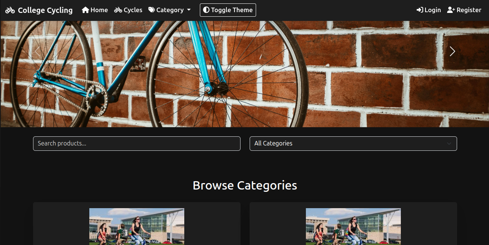
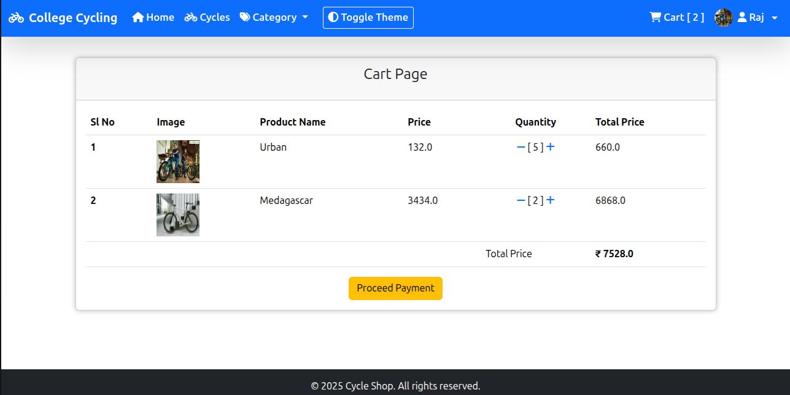
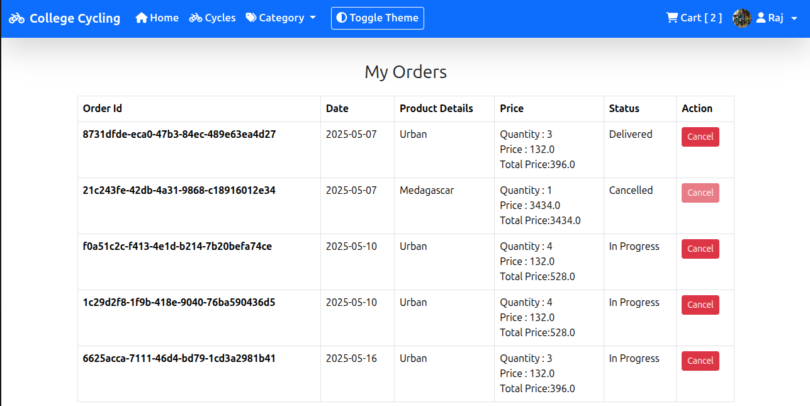
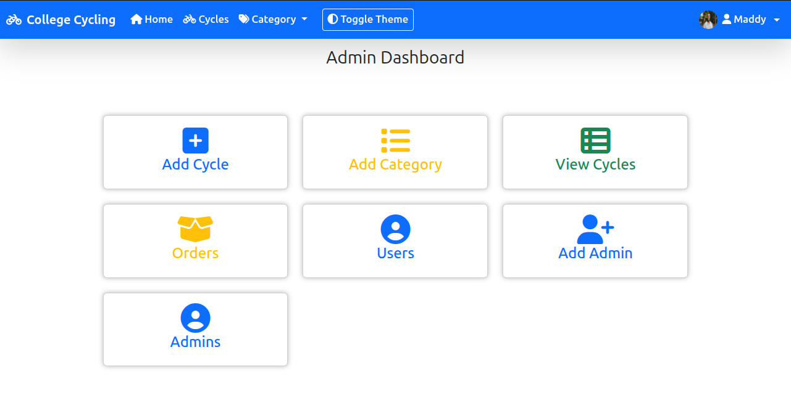

# 🚲 Bicycle Management System

A Spring Boot-based e-commerce platform designed to facilitate the buying and selling of bicycles within a college campus. This system enables students to trade bicycles seamlessly with user-friendly interfaces and powerful backend support.

---

## 🌟 Features
✅ User Registration & Login (Spring Security)  
✅ Browse Bicycle Listings  
✅ Detailed Bicycle Information View  
✅ Add to Cart and Checkout Process  
✅ Order Management & Tracking  
✅ Admin Dashboard for User and Inventory Management  
✅ Responsive UI with Thymeleaf Templates  

---

## 🛠️ Tech Stack
- **Backend**: Java, Spring Boot, Spring MVC, Spring Security
- **Frontend**: HTML, CSS, JavaScript, Thymeleaf
- **Database**: MySQL
- **ORM**: Hibernate / JPA
- **Build Tool**: Maven
- **Version Control**: Git & GitHub

---

## 📸 Screenshots

### 🏠 Home Page


### 🔐 Login Page


### 🛒 Cart


### 📦 Order Summary


### 🛠 Admin Dashboard


---

## 🚀 Getting Started

### Prerequisites
- Java 11+
- Maven
- MySQL Server

### Setup Steps
1. Clone the repository:
   ```bash
   git clone https://github.com/006Achintya/bicycle-management-system.git
   cd bicycle-management-system
2. Configure application.properties with your MySQL credentials.
3. Run the application
4. Access the app at http://localhost:8080
